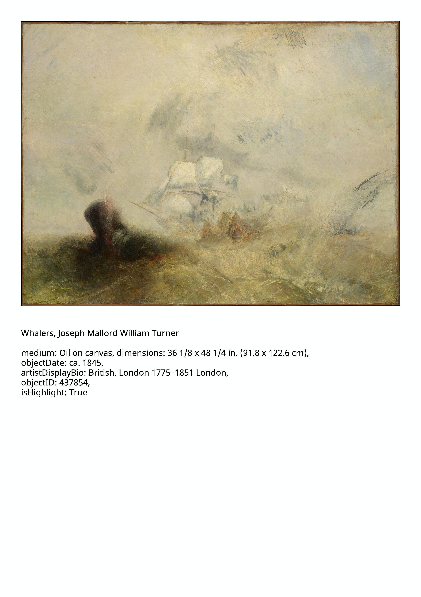

#dailyArt
##Generates a page with a classical painting and descriptions

Fetches an European painting from the The Metropolitan Museum of Art Collection API (<https://metmuseum.github.io/>)
and put it on a A4-sized page (2480 x 3508) with some descriptions.

###Example

Uses Python 3.
Font used: Noto Sans(<https://fonts.google.com/noto/specimen/Noto+Sans>)